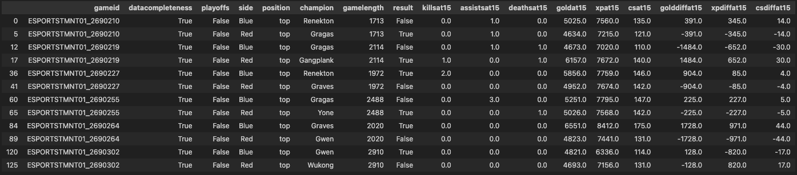

# A League of Legends Competitive Analysis

In the ever-evolving landscape of esports, one game stands out as a titan among its peers—League of Legends. As we stride into the heart of 2022, the competitive scene of this multiplayer online battle arena (MOBA) continues to captivate audiences with its strategic depth, intense team dynamics, and the relentless pursuit of victory on the Summoner's Rift.

The year 2022 has witnessed a symphony of skill, innovation, and calculated risk-taking as professional teams from around the world converge to compete in the League of Legends global ecosystem. From the intense battles in regional leagues to the grandeur of international tournaments, each match serves as a canvas where players paint their narratives, leaving an indelible mark on the competitive landscape.

This analysis delves into the multifaceted dimensions of League of Legends esports in 2022. From champion picks and bans to macro and micro plays, we embark on a journey to dissect the strategies, meta shifts, and standout moments that have defined the competitive metagame this year. Join us as we unravel the narrative of League of Legends competitive matches in 2022.

As we navigate through the statistics, trends, and standout performances, our aim is to provide a comprehensive exploration of the evolving dynamics within the League of Legends esports sphere. Buckle up as we delve into the heart of the action, unraveling the tales of triumphs, setbacks, and the ever-shifting sands of competitive play in the world of League of Legends in 2022.

## Contents

- [Introduction](#introduction)
- [Cleaning and EDA](#cleaning-and-EDA)
  - [Cleaning](#cleaning)
  - [EDA (exploratory data analysis)](#exploratory-data-analysis)
- [Assessment of Missingness](#assessment-of-missingness)
- [Hypothesis Testing](#hypothesis-testing)
- [Author](#author)

## Introduction

In this analysis, we wanted to analyze the best of the best: Competitive Games, and we decided to use a recent year, 2022, to show this. In our analysis, we will analyze one specific question that we believe is very important to how winning games, the primary objective of League, is decided:

<strong>Does a winning top lane affect the probability of a team winning the game?</strong>

Top lane, one of the five positions in League of Legends, is typically observed as a solo lane, meaning they often don't receive too much help from other players and especially the jungle, which typically (at least recently) prioritizes objectives like Dragons, Heralds, and Barons instead of ganking near top. 

Therefore, we wanted to ask this question, because it is especially relevant—we observed (with out eyes) that top lanes often didn't really help a team unless they were doing exceptionally well and could carry the team, meaning they observed a very large gold lead. Therefore, we wanted to see how often they actually made teams better, and if they did, was it significant to winning in pro-play. In doing so, we looked through 149400 rows (or 12450 games) worth of data. In filtering our data, we realized that of the 123 columns that were provided, we only needed these 17: ['gameid', 'datacompleteness', 'playoffs', 'side', 'position', 'champion', 'gamelength', 'result', 'killsat15', 'assistsat15', 'deathsat15', 'goldat15', 'xpat15', 'csat15', 'golddiffat15', 'xpdiffat15', 'csdiffat15'].

For these columns, 'gameid' allowed us to groupby stats of each game, 'datacompleteness' allowed us to verify if the data was complete (and therefore usable), 'position' and 'champion' allowed us to experiment with each position and how well they were played, and the rest of the columns were used in order to help us create a test statistic to test whether or not a top-lane was winning in each particular game.

## Cleaning and EDA

One of the most important (and time consuming) processes that data scientists go through is cleaning the data. Here, we explore the cleaning process as well as the Exploratory Data Analysis that led us to getting our results

### Cleaning

First, we had to get the data from somewhere. Fortunately, Oracle has data of all the competitive matches that occur each year, so all we had to do was download the csv files that allowed us to get the data. 

Then, we created a dataframe that allowed us to filter for the data that was needed for the analysis. After getting our data, we converted a lot of non-boolean values into boolean values like True and False to help our filtering in the future easier. For example, the columns 'datacompleteness', 'playoffs', and 'result' all were converted into 'True' and 'False' in order to make our data make more sense. Additionally, in this section, we also were able to locate the columns that were needed, which were ['gameid', 'datacompleteness', 'playoffs', 'side', 'position', 'champion', 'gamelength', 'result', 'killsat15', 'assistsat15', 'deathsat15', 'goldat15', 'xpat15', 'csat15', 'golddiffat15', 'xpdiffat15', 'csdiffat15'].

At this point, we also wanted filter our data in order to have a dataframe that only consisted of complete data ('datacompleteness' == True) and data that only consisted of the top lane position ('position' == 'top'). This would allow us easy access to be able to go through this data in the future. 

### Exploratory Data Analysis

...

## Assessment of Missingness

...

## Hypothesis Testing

...

## Authors

**Kevin Wong**
- <https://github.com/kev374k>
- <https://twitter.com/justkevin999>

**Andrew Yang**
- <https://github.com/AHY123>
