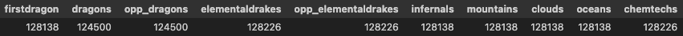

# A League of Legends Competitive Analysis

In the ever-evolving landscape of esports, one game stands out as a titan among
its peers—League of Legends. As we stride into the heart of 2023, the 
competitive scene of this multiplayer online battle arena (MOBA) continues to 
captivate audiences with its strategic depth, intense team dynamics, and it's
players' relentless pursuit of glory on the Summoner's Rift.

The year 2022 has witnessed a symphony of skill, innovation, and calculated 
risk-taking as professional teams from around the world converge to compete in 
the League of Legends global ecosystem. From the intense battles in regional 
leagues to the grandeur of international tournaments, each match serves as a 
canvas where players paint their narratives, leaving an indelible mark on the 
competitive landscape.

This analysis delves into the multifaceted dimensions of League of Legends 
esports in 2022. From champion picks and bans to macro and micro plays, we 
embark on a journey to dissect the strategies, meta shifts, and standout 
moments that have defined the competitive metagame this year. Join us as we 
unravel the narrative of League of Legends competitive matches in 2022.

As we navigate through the statistics, trends, and standout performances, 
our aim is to provide a comprehensive exploration of the evolving dynamics 
within the League of Legends esports sphere. Buckle up as we delve into the 
heart of the action, unraveling the tales of triumphs, setbacks, and the 
ever-shifting sands of competitive play in the world of League of Legends in 2022.

## Contents

- [Introduction](#introduction)
- [Cleaning and EDA](#cleaning-and-EDA)
  - [Cleaning](#cleaning)
  - [Univariate Analysis](#univariate-analysis)
  - [Bivariate Analysis](#bivariate-analysis)
  - [Interesting Aggregates](#interesting-aggregates)
- [Assessment of Missingness](#assessment-of-missingness)
  - [NMAR Analysis](#nmar-analysis)
  - [Missingness Dependency](#missingness-dependency)  
- [Hypothesis Testing](#hypothesis-testing)
- [Author](#author)


## Introduction

In this analysis, we wanted to analyze the best of the best: Competitive Games,
and we decided to use the most recent completed season, the 2022 season, to 
show this. In our analysis, we will analyze one specific question that we 
believe is very important to how winning games, the primary objective of 
League, is decided:

<strong>Does a winning top lane affect the probability of a 
team winning the game?</strong>

Top lane, one of the five positions in League of Legends, is typically observed
as a solo lane, meaning they often don't receive too much help from other 
players on their team and especially the jungle, which typically (at least 
recently)prioritizes objectives like Dragons, Heralds, and Barons instead of 
helping near top. 

Therefore, we wanted to ask this question, because it is especially relevant—we
observed (with out eyes) that top lanes often didn't really help a team unless 
they were doing exceptionally well and could carry the team, meaning they 
observed a very large gold lead. Therefore, we wanted to see how often they 
actually made teams better, and if they did, was it significant to winning in 
pro-play. In doing so, we looked through 149400 rows (or 12450 games) worth of 
data. In filtering our data, we realized that of the 123 columns that were 
provided, we only needed these 17 to help us answer our question:```['gameid', 'datacompleteness', 
'side', 'position', 'result', 'killsat15', 'assistsat15', 'deathsat15', 
'goldat15', 'xpat15', 'csat15', 'golddiffat15', 'xpdiffat15', 'csdiffat15']```.

For these columns, 'gameid' allowed us to differentiate different games, 
'datacompleteness' allowed us to verify if the data was complete (and therefore
usable), 'position' and 'champion' allowed us to get the position we wanted (top)
and what champion they played. The rest of the columns were used in order 
to help us create a test statistic to test whether a top-lane was 
winning in each particular game.

Description of columns:
- ```'gameid'```: the unique identifiers for the games that occurred. Used to
differentiate each game.
- ```'data'```: indicator of whether the data for this row is complete or 
missing certain information. Used to check if the row may be missing data in
other relevant columns.
- ```'side'```: differentiates the players in the game as ```'blue'``` or 
```'red'``` based on the side they were playing as.
- ```'position'```: describes which position the player played as.
- ```'result```: describes whether the team of the player won in the end or 
not. ```True``` when the team won, ```False``` when the team lost.
- 

## Cleaning and EDA

One of the most important (and time-consuming) processes that data scientists 
go through is cleaning the data. Here, we explore the cleaning process as well 
as the Exploratory Data Analysis that led us to getting our results

### Cleaning

First, we had to get the data from somewhere. Fortunately, Oracle has data of 
all the competitive matches that occur each year, so all we had to do was 
download the csv files that allowed us to get the data. 

```
df = pd.read_csv("2022_LoL_esports_match_data_from_OraclesElixir.csv")
```

Then, we created a dataframe that allowed us to filter for the data that was needed for the analysis. After getting our data, we converted a lot of non-boolean values into boolean values like True and False to help our filtering in the future easier. For example, the columns 'datacompleteness', 'playoffs', and 'result' all were converted into 'True' and 'False' in order to make our data make more sense. Additionally, in this section, we also were able to locate the columns that were needed, which were ['gameid', 'datacompleteness', 'playoffs', 'side', 'position', 'champion', 'gamelength', 'result', 'killsat15', 'assistsat15', 'deathsat15', 'goldat15', 'xpat15', 'csat15', 'golddiffat15', 'xpdiffat15', 'csdiffat15'].

```
cleaned_data = df.assign(
    datacompleteness = df['datacompleteness'].apply(lambda x: True if x == "complete" else False),
    playoffs = df['playoffs'].apply(lambda x: True if x == 1 else False),
    result = df['result'].apply(lambda x: True if x == 1 else False)
    ).loc[
        :, ['gameid', 'datacompleteness', 'playoffs', 'side', 'position', 'champion', 'gamelength', 'result', 'killsat15', 'assistsat15', 'deathsat15', 'goldat15', 'xpat15', 'csat15', 'golddiffat15', 'xpdiffat15', 'csdiffat15']
    ]
```

At this point, we also wanted filter our data in order to have a dataframe that only consisted of complete data ('datacompleteness' == True) and data that only consisted of the top lane position ('position' == 'top'). This would allow us easy access to be able to go through this data in the future. 

<div style = "text-align:center">
  
</div>

### Univariate Analysis

...

### Bivariate Analysis

...

### Interesting Aggregates 

...

## Assessment of Missingness

### NMAR Analysis

For data that could be qualified as NMAR, the data has to be essentially missing on itself. The reason why it's missing is likely to do with it's own value.

For this dataset, we looked through a lot of the columns that had missing data, and observed that columns like 'dragons' and 'opp_dragons', and their types of dragons ('infernals', 'mountains', 'clouds', 'oceans', and 'chemtechs') were missing very often. We theorize that these columns are NMAR, because if the entry in these columns are NaN, this likely means that there were no dragons or no specific dragon killed/found in that game, meaning the data was likely just not inputed instead of having '0' in the entry. For these, some additional data that could technically explain missingness could potentially be the number of dragons present in the game (which also has a lot of NaN values), because just intuitively, the more dragons there are in a game, the higher the likelihood that there is a larger variety of dragons.

```
missing_data = pd.DataFrame(df.isnull.sum()).T
```
<div style = "text-align:center">
  
</div>

### Missingness Dependency

For missingness, we wanted to analyze why some data was marked complete while others were marked partial. In our observations, we noticed that a lot of the data from the 'LPL' league, which is from China, was partially missing, especially the columns at the end of the DataFrame, which we needed. We wanted to see if this was actually a pattern, because from the mini-observations we had from looking through the data, it looked like most of the missing/incomplete data was from Chinese leagues, like the 'LPL' and the 'LDL'.

Therefore, we tested our original DataFrame, df, and assessed which columns were missing data regularly. Specifically, we noticed that one of our most important columns, 'opp_csat15', was missing very often and also at the same amounts as other columns near the end of the DataFrame.

In order to test these out, we singled out variables that we thought would have a correlation to whether or not 'opp_csat15' was missing. First, we wanted to decide our test statistic from our normal data. In doing this, we took all of our rows where 'opp_csat15' was NaN, and filtered out to get the columns of ['league', 'split', 'playoffs', 'patch', and 'position']. 

```
missing_important_data = df[df['opp_csat15'].isnull()]
missing_data = missing_important_data.loc[:, ['league', 'split', 'playoffs', 'patch', 'position']]
missing_data
```

<div style = "text-align:center">
  
</div>

By using the groupby() method, we were able to test out our columns and see the missingness of certain leagues. Jumping to our test statistic, we noticed that the Missingness Distribution of 'league' compared to the others that we tested seemed a lot more lopsided. 

<div style = "text-align:center">
  <iframe src = "assets/league_missingness_distribution.html" width = 800 height = 600 frameBorder = 0></iframe>
</div>

When looking at this graph, it looks like missingness is extreme in leagues like the 'LPL' and 'LDL', like we observed earlier when analyzing the dataset. In fact, with 'LDL' carrying a Missingness Proportion of 0.517867, meaning for all missing values in 'opp_csat15', the 'LDL' is the league over 50% of the time.

Although this can be explained by the 'LDL' having over 50% of all competitive games, we want to test the dataset in full my permuting the columns that we tested in order to see if it's possible to have a league have a value as high as 0.517867

```
test_df = (df
           .assign(league = np.random.permutation(df['league']))
           .assign(split = np.random.permutation(df['split']))
           .assign(playoffs = np.random.permutation(df['playoffs']))
           .assign(patch = np.random.permutation(df['patch']))
           .assign(position = np.random.permutation(df['position']))
           )
test_df = test_df[test_df['opp_csat15'].isnull()].loc[:, ['league', 'split', 'playoffs', 'patch', 'position']]
```

Then, by grouping 'league' again, we randomized all of the leagues and looked at the null values once again, to see if any league could top over 50% rate of missingness. 

<div style = "text-align:center">
  <iframe src = "assets/permutated_league_missingness.html" width = 800 height = 600 frameBorder = 0></iframe>
</div>

As you can see, even our league with the largest share of missing values when permutated cannot even hit 0.1 of the total missingness on column 'opp_csat15'. This implies that the missingness of this column is likely Missing at Random, dependent on the 'league' column. To test this, let's use a pair of hypotheses and a significance level of 0.01 with 1000 trial runs.


<strong>
Null Hypothesis:</strong> Data that is missing comes from the same 'league' distribution as all other data

<strong>Alternative Hypothesis:</strong> Data that is missing is significantly more likely to be one 'league' than others

```
differences = []
for _ in range(1000):
    test_df = df.assign(league = np.random.permutation(df['league']))
    stats = test_df[test_df['opp_csat15'].isnull()].groupby('league')['playoffs'].count()
    differences.append(stats[stats.index == 'LDL'].iloc[0]/stats.sum())
    
p_value = np.mean(np.array(differences) >= 0.517867)
```

Here, our p-value return 0.0, meaning that we can reject our null hypothesis, meaning that it is likely that data missing from 'opp_csat15' is significantly more likely to be in at least one 'league' than others - this in turn means that 'opp_csat15' has data that is Missing At Random. 

Now, let's find a column that 'opp_csat15' does not depend on. Intuitively, 'opp_csat15' shouldn't depend on columns that are aggregated throughout our data extremely evenly; that is, columns that have no relation and are evenly spread out should not have any correlation with 'opp_csat15'. One of these columns is 'position', which will always be even regardless of the matches, since all games will have 2 of each position.

Here, let's test what the position missingness of 'opp_csat15' looks like when we groupby() on the 'position' column.

<div style = "text-align:center">
  <iframe src = "assets/position_missingness.html" width = 800 height = 600 frameBorder = 0></iframe>
</div>

Here, we can see missingness is split dead even between all of the positions, which we expeceted. This gives us a test statistic of (1/6). Now, in order to test if 'opp_csat15' is dependent on 'position', we want to do another permutation test to test our hypothesis that the missingness of 'opp_csat15' comes from same distribution as the whole of 'opp_csat15', tested at the 0.01 significance level

<strong>Null Hypothesis:</strong> The missingness of NA values in the 'opp_csat15' column comes from the same distribution regardless of the position player's have played

<strong>Alternative Hypothesis:</strong> The missingness of NA values in 'opp_csat15' column is dependent on a position played

```
position_differences = []
for _ in range(1000):
    test_df = df.assign(position = np.random.permutation(df['position']))
    stats = test_df[test_df['opp_csat15'].isnull()].groupby('position')['gameid'].count()
    position_differences.append(stats.iloc[0]/stats.sum())

position_pval = np.mean(np.array(position_differences) >= (1/6))
```

Here, our position_pval equates to around ~0.5, meaning that in this case, we fail to reject the null hypothesis, meaning there is no sufficient evidence that the 'position' column plays an effect on the missingness of 'opp_csat15'. For an even more thorough example, here is a permutated version of our earlier graph, to test how often a position went over 1/6.

<div style = "text-align:center">
  <iframe src = "assets/permutated_position_missingness.html" width = 800 height = 600 frameBorder = 0></iframe>
</div>

As you can see, this happened very often, because at the end of the day, the missingness of 'opp_csat15' never relied on 'position'.

## Hypothesis Testing

...

## Authors

**Kevin Wong**
- <https://github.com/kev374k>
- <https://twitter.com/justkevin999>

**Andrew Yang**
- <https://github.com/AHY123>
